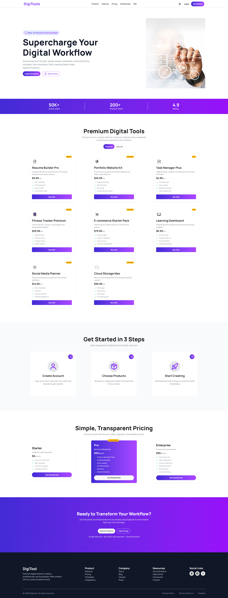
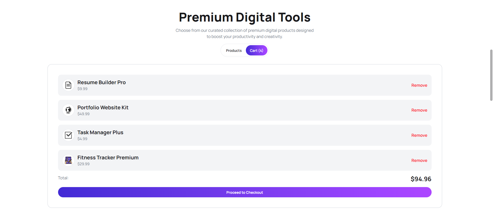

# DigiTools

Discover and purchase premium digital tools in a clean, modern, and responsive web experience.


## About The Project

DigiTools is a product showcase and cart-based web app where users can browse curated digital products, view product details, and manage purchases through an interactive cart system.

## Technology Used

- React
- Vite
- Tailwind CSS
- DaisyUI
- Axios
- React Toastify
- Lucide React + React Icons

## 3 Project Features

1. Dynamic Product Browsing
Products are loaded from local JSON data and displayed as premium tool cards with pricing, descriptions, and feature lists.

2. Smart Cart Management
Users can add products to cart, avoid duplicate entries, remove items, and see a live subtotal update instantly.

3. Smooth Purchase Flow
The app includes checkout interaction with success and error toast notifications for a polished user experience.

## Live Demo

- Website: [View Live Demo](https://digitool-shopping.netlify.app/)

## Screenshots Preview

### Homepage Preview



### Product and Cart Flow 




## Run Locally

```bash
npm install
npm run dev
```

## Build For Production

```bash
npm run build
```

## Author & Contact

- Name: Antick Chandra Kuri
- Email: antickroy018@gmail.com
